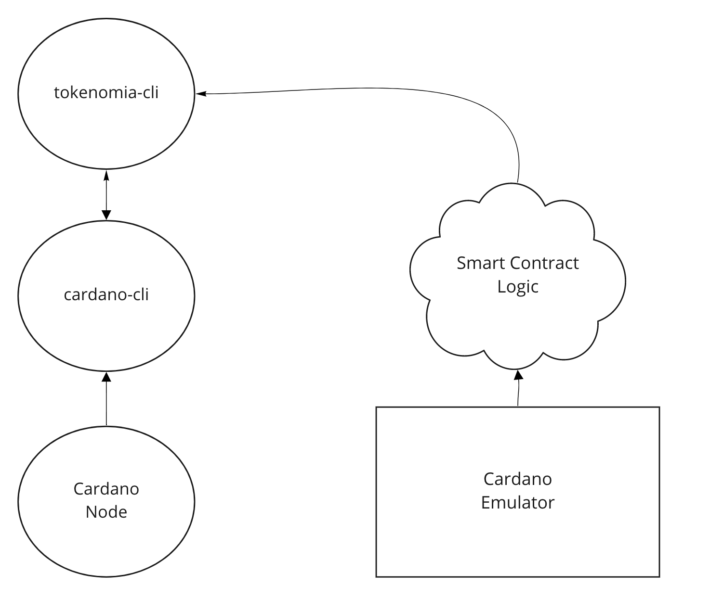

Tokenomia aims to simplify the use of Native Tokens and Smart Contracts above the Cardano Platform for the needs of [Smart Chain](https://smart-chain.fr/en/) Developments.

This Project is still in an early stage and the first goal here is to simplify the production of tokens with some vesting logic (Our fisrt tokenomic over the Cardano Platform). This implies the following capabilities : 
- Automating the creation of organisational wallets
- Minting and Burning tokens over a specific monetary Policy
- Applying Some Custom Vesting Logic   

## Technical Approach 

we are providing `tokenomia-cli` as a first artefact :
- it pilots `cardano-cli` thanks to the haskell `shh` library. 
- Generate some "wallets" (so far we are only generating payment adressesses via `cardano-cli` but we'll use `cardano-adresses` evntually)
- Progressively uses plutus codebase (Minting Policies,TxOutRef,Value...) over `cardano-cli`

For the visual people, here is a simple view of `tokenomia-cli` :




`tokenomia-cli` is saving information at `~/.tokenomia-cli/`, here is a simple example of the structure : 

```shell
.
|-- keys
|   |-- Athena
|   |   |-- payment-signing.skey
|   |   |-- payment-verification.vkey
|   |   |-- payment.addr
|   |   |-- stake-signing.skey
|   |   `-- stake-verification.vkey
|   `-- Zeus
|       |-- payment-signing.skey
|       |-- payment-verification.vkey
|       |-- payment.addr
|       |-- stake-signing.skey
|       `-- stake-verification.vkey
|-- parameters
|   `-- parameters-testnet.json
`-- transactions
    |-- 0e10fd80e44172d0ec31dce1d537fe0c.raw
    |-- 0e10fd80e44172d0ec31dce1d537fe0c.signed
    |-- 10cef34466ccbe574e91abdce3b462662d5ca88b3836b286d6eaf577.plutus
    |-- 43f4b575a39a885c0bbfd2e787d0d4ee343ab9dd410fee970fcd9969.plutus
    |-- 666abb9219aa12f199b403e263ab8107.raw
    |-- 666abb9219aa12f199b403e263ab8107.signed
    |-- 6681340d7ea6804b8fb7fac624a21bfa.raw
    |-- 6681340d7ea6804b8fb7fac624a21bfa.signed
    |-- 7ab273056996bcc9479ace89941d02dae115b0d96ee5ce2da34b2774.plutus
    |-- 94cb16873c5f858a0c3f61b2ffe1b57c5d303a8c8a995f034030c861.plutus
    |-- a4fe55f29156a7f74812fc5f181bce7986322345da17e5b44ff38652.plutus
    |-- b5cb3f28d92493a68d904ec8df0927e3.raw
    |-- cfe139b73748cc0343a6711f517b024a.raw
    `-- cfe139b73748cc0343a6711f517b024a.signed

```
- `Zeus` and `Athena` are 2 "wallets" generated into the `/keys` folders.
- The `transaction` folder is used for building transactions (minting policy scripts,raw and signed transations)

## What you can do with it so far

|Wallet Management 
---------- | 
List registered wallets
Add a wallet
Remove a wallet 

|Native Token
---------- | 
Mint a token
Burn a token (coming soon)
Transfer a token

## "Roadmap" 

- fee calculation when submitting transactions
- add the creation of a collateral utxos into a wallet
- redeeming tokens
- add Vesting capabilities (only minting token is implemented so far)
- use `cardano-adresses` to have "real" wallets and being able to restore them in deadalus
- options for testnet/mainnet 
- add `waitTxConfirmation` to submitted transactions 

## Debates

- passing directly on `cardano api` vs `cardano-cli` over `shh` 
    - directly on `cardano api`  
        - Avoid unecessary serialization/deserialisation over `cardano-cli`
        - can we do more than `cardano-cli` is doing ? 
        - Less IO processing (maybe easier for testing)
    - `cardano-cli` over `shh`
        - Once the serialisation logic is done, using shh gives us some interesting velocity
        - Code logic is simple despite the fragility of wrapping command line.      


## Development Tasks (Only tested on Ubuntu)

### Environment Setup

- The same used in the  [plutus starter project](https://github.com/input-output-hk/plutus-starter).
- You need to install `cardano-cli` 1.29.0  as well, see [cardano-node project](https://github.com/input-output-hk/cardano-node)  

### Run tokenomia-cli

```shell
nhenin@ubuntu ~/d/tokenomia (main)> nix-shell 
...
[nix-shell:~/dev/tokenomia]$ cabal run tokenomia:exe:tokenomia-cli
```


